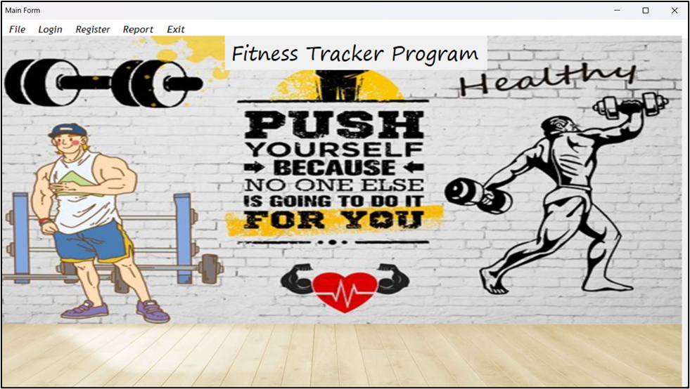
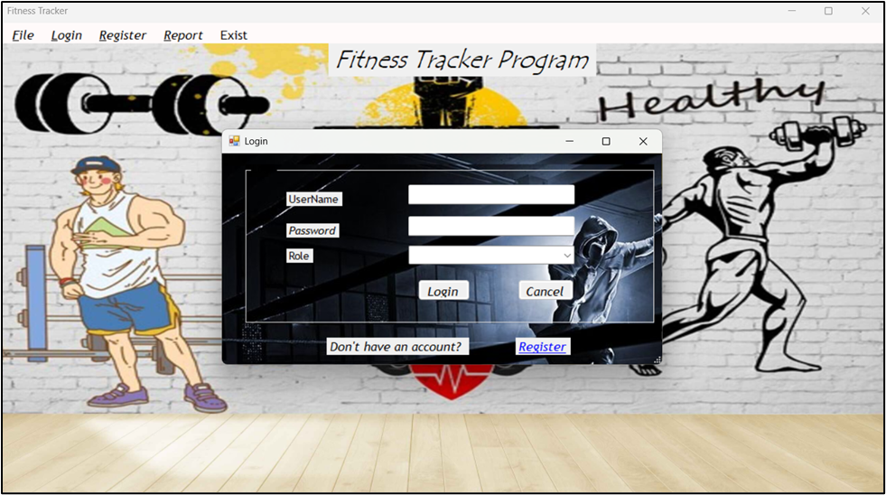
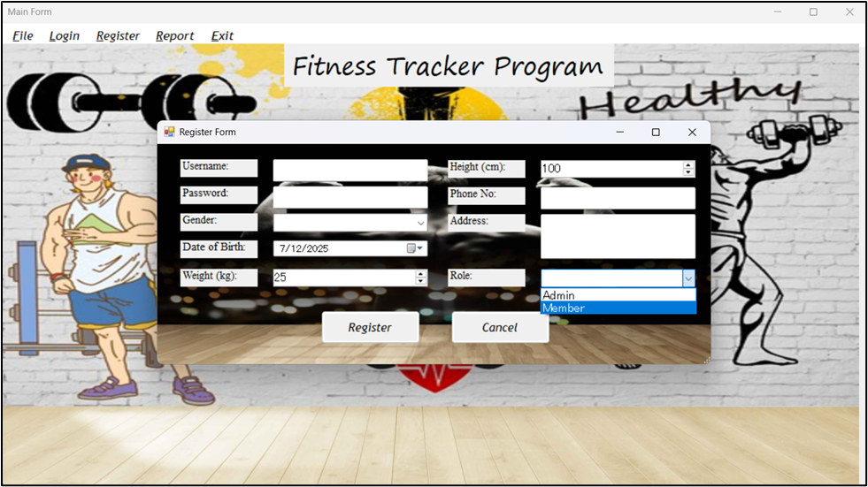
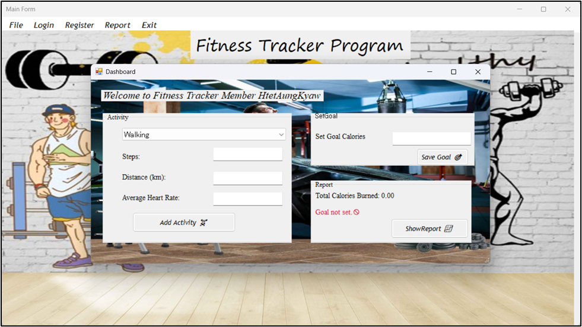
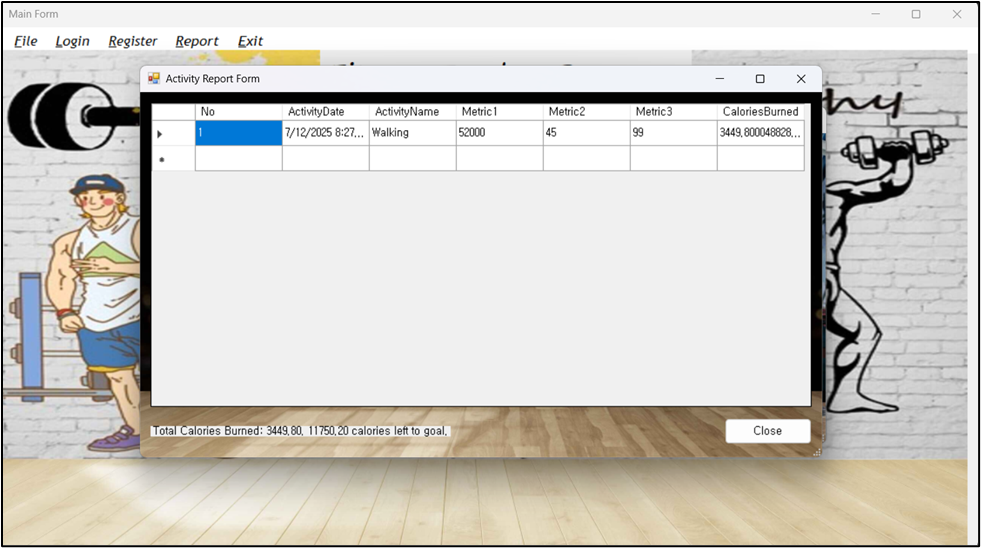

# Fitness Tracker

**Fitness Tracker** is a health and wellness mobile application that helps users monitor, record, and improve their physical activities. It is designed for anyone who wants to stay active, reach fitness goals, and maintain a healthy lifestyle.

With **Fitness Tracker**, users can:

- Create a personal account and log in securely.
- Track workouts such as running, walking, cycling, and gym exercises.
- Monitor daily steps, distance covered, calories burned, and active minutes.
- Set personalized fitness goals and measure progress.
- View detailed activity reports with charts and summaries.

The app features an intuitive interface, easy navigation, and real-time progress tracking. Data is stored securely in the cloud, allowing users to access their fitness history anytime, anywhere.

Whether you’re training for a marathon, trying to lose weight, or simply aiming to stay fit, **Fitness Tracker** makes it easier to stay motivated and consistent on your fitness journey.

---

## Screenshots

<table>
  <tr>
    <td></td>
    <td></td>
    <td></td>
    <td></td>
    <td></td>
  </tr>
</table>

---
